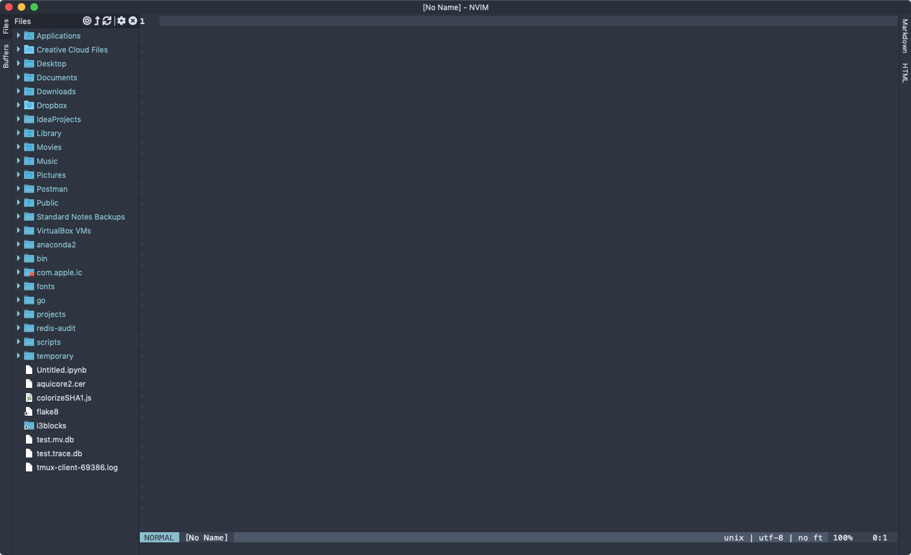

# Welcome

Before we start, it would be a crime not to mention [Neovim](https://neovim.io/)
Neovim is a fork of the original Vim codebase that has done a lot of really great work modernizing and improving the tool with a bunch of great stuff like:

- Great API docs and improvements
- Remote plugins run as co-processes, safely and asynchronously
- GUIs, IDEs and web browsers can `--embed` Neovim as an editor or script host
- Strong defaults
- Modern terminal features such as cursor styles and focus events
- Fully compatible with Vim's editing model and the Vimscript language.

## Resources

### Learning Vim

- [Vim Adventures](https://vim-adventures.com) Browser based game
- Vimtutor Vim's built in tutorial (launch in the terminal with `vimtutor`, it comes with Vim by default!)
- [Vimcasts](http://vimcasts.org) Free screencasts
- [Practical Vim](https://pragprog.com/book/dnvim2/practical-vim-second-edition) High quality book, not free though 😔
- [Vim Cheat Sheet](http://www.viemu.com/a_vi_vim_graphical_cheat_sheet_tutorial.html) Unofficial cheat sheet

### Editors With Vim Integrations

- [Jetbrains (Intellij, Webstorm, Pycharm)](https://www.jetbrains.com/)
  - [Ideavim](https://github.com/JetBrains/ideavim)
- [VSCode](https://code.visualstudio.com/)
  - [Vim](https://marketplace.visualstudio.com/items?itemName=vscodevim.vim)
- [Sublime Text](https://www.sublimetext.com/3)
  - [Vintage Mode](https://www.sublimetext.com/docs/2/vintage.html)
- [Atom](https://atom.io/)
  - [Vim-mode](https://github.com/atom/vim-mode)
- [Eclipse](https://www.eclipse.org/)
  - [Vwrapper](http://vrapper.sourceforge.net/home/)
  - [Vimplugin](https://sourceforge.net/projects/vimplugin/)
  - [Eclim](http://eclim.org/)

#### 🎉 Bonus 🎉 - Web Browsers! Really, it's Awesome

- [Firefox](https://www.mozilla.org/en-US/firefox/new/)
  - [Vimium-FF](https://addons.mozilla.org/en-US/firefox/addon/vimium-ff/)
- [Chrome](https://www.google.com/chrome/)
  - [cVim](https://chrome.google.com/webstore/detail/cvim/ihlenndgcmojhcghmfjfneahoeklbjjh?hl=en)
  - [Vimium](https://chrome.google.com/webstore/detail/vimium/dbepggeogbaibhgnhhndojpepiihcmeb)

### Vim GUIs (Applications that provide a modern GUI around Vim)



- [Macvim](https://macvim-dev.github.io/macvim/)
- [Vimr](http://vimr.org/)
- [Onivim 2](https://onivim.io/)

### Vim Distributions (preconfigured Vim plugins and settings)

Note: I don't recommend you start with these. They will give you some nice things out of the box,
but they obfuscate a lot of the configuration and when you're learning it's often better to do this stuff by hand

- [EverVim](https://github.com/LER0ever/EverVim)
- [SpaceVim](https://spacevim.org/)

### High Quality Plugins

1. fzf https://github.com/junegunn/fzf.vim
2. lightline https://github.com/itchyny/lightline.vim
3. surround https://github.com/tpope/vim-surround
4. NERDTree https://github.com/scrooloose/nerdtree

## Start The Slides

1. Serve the presentation and monitor source files for changes
   ```sh
   $ npm start
   ```

2. Open <http://localhost:8000> to view your presentation

   You can change the port by using `npm start -- --port=8001`.

## Folder Structure

- **css/** Core styles without which the project does not function
- **js/** Like above but for JavaScript
- **plugin/** Components that have been developed as extensions to reveal.js
- **lib/** All other third party assets (JavaScript, CSS, fonts)
